# Audiophile - Full-Stack E-commerce Platform

> This is one of the best projects I've worked on, especially in the context of full-stack development, and it was the first time I'd worked on a project of this scale. The end result really impressed me.

## Preview

### [Live Demo](https://audiophile-web-space.vercel.app) · [GitHub Repository](https://github.com/tastyfan14/audiophile) · [Frontend Mentor](https://www.frontendmentor.io/solutions/full-stack-solution-built-with-nextjs-typescript-express-and-prisma-cjuuIBkQOJ)

### Desktop

<p>
    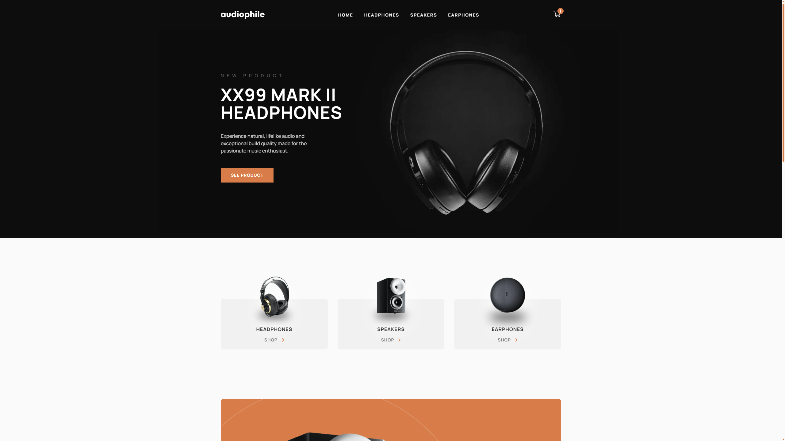
    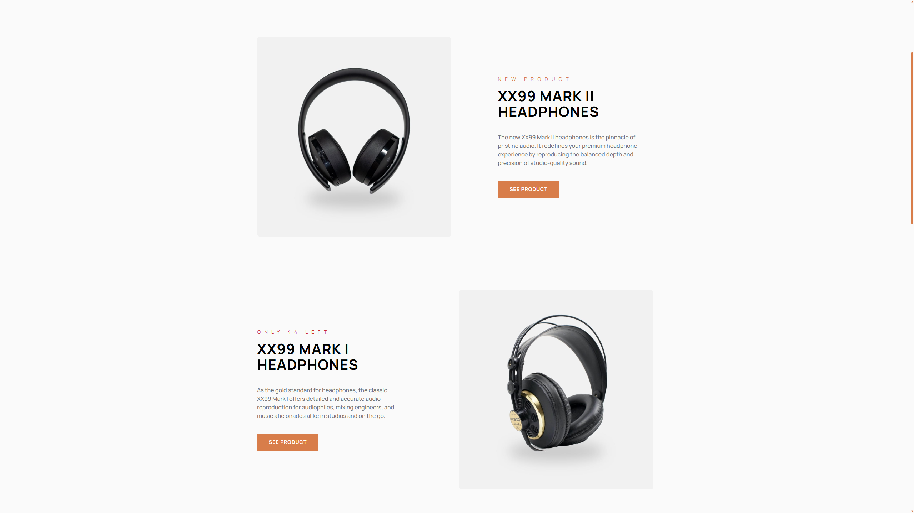
    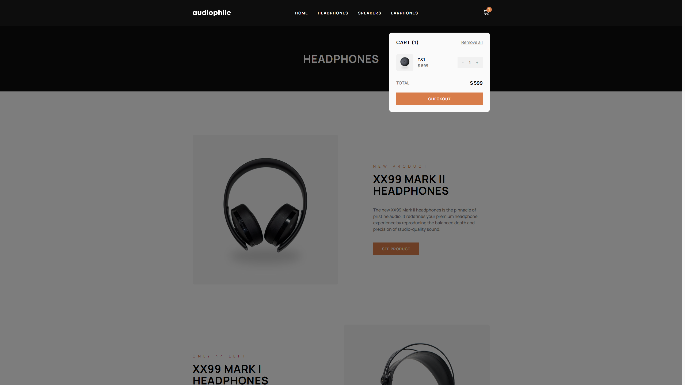
    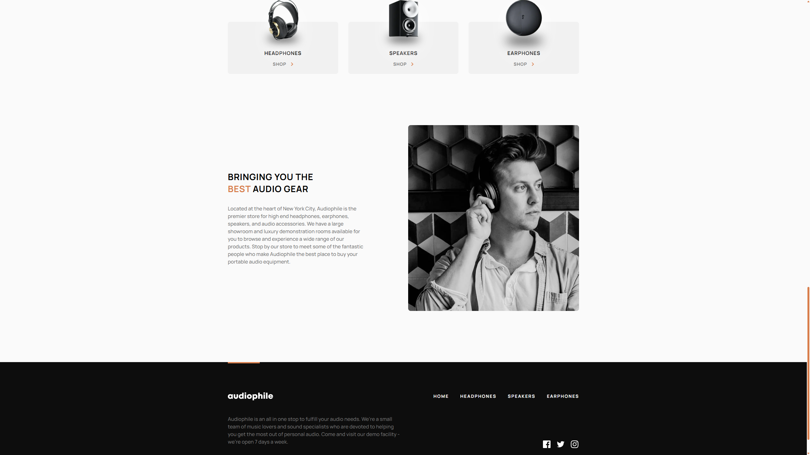
    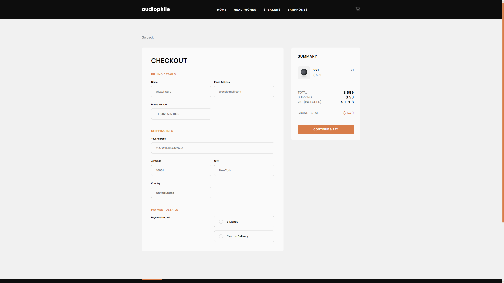
</p>

### Mobile

<p>
    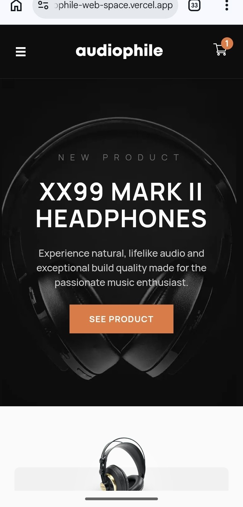
    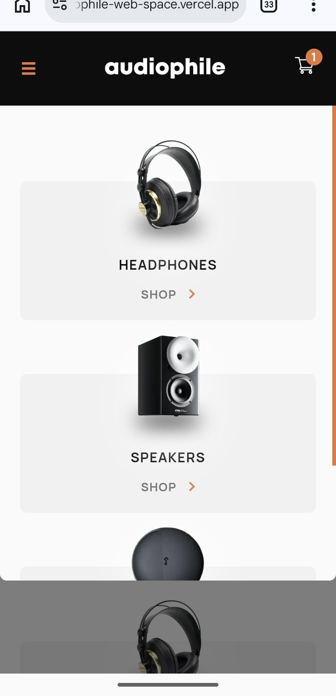
    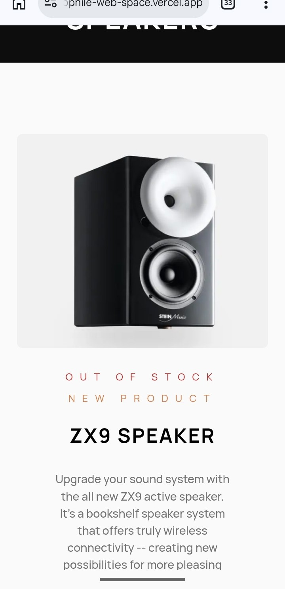
    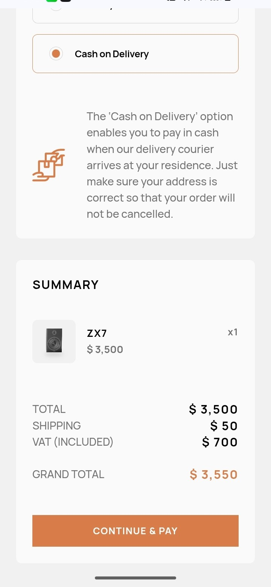
</p>

## Features

- Full-featured product catalog with categories and dynamic product pages.
- Fully responsive interface for mobile, laptop and desktop.
- Responsive images with optimized viewport variants.
- Product availability states: **new**, **low stock**, **out of stock**.
- Persistent shopping cart with quantity management and automatic price calculations.
- Stock-aware cart and checkout with server-side revalidation.
- Full checkout flow with conditional payment validation and loading/success/error states.
- Server-side order and stock validation with appropriate HTTP status codes.
- Shared TypeScript types, DTOs and constants across frontend and backend.
- TanStack Query for server-state caching and revalidation.
- Zustand for persistent client-side cart state.
- Unit, integration, API and E2E testing with MSW mocking.
- Accessibility-focused implementation with keyboard navigation, focus management and ARIA.
- Production error monitoring with Sentry.

## Tech Stack

| Layer | Technologies |
|---|---|
| **Frontend** | Next.js 16, React 19, TypeScript 5, SCSS |
| **State Management** | Zustand 5 |
| **Server State** | TanStack Query 5 |
| **Forms & Validation** | React Hook Form 7, Zod 4 |
| **Backend** | Node.js 24, Express, TypeScript 7 |
| **Database** | PostgreSQL 17, Prisma 7 |
| **Testing** | Vitest 5, React Testing Library 16, Playwright 1 |
| **API Testing** | Supertest |
| **Mocking** | MSW 2 |
| **Architecture** | pnpm, Turborepo, FSD architecture |

## Infrastructure

| Layer | Service |
|---|---|
| **Frontend** | Vercel |
| **Backend** | Render |
| **Database** | Neon |
| **Local Development** | Docker |
| **Monitoring** | Sentry |

## Quality & Production

### Production Testing

Immediately after deployment, I identified and fixed an issue with the modal display, tested the app from start to finish, and handed it over to real users for testing:

#### Tester 1 (mobile, desktop):
- The buttons weren't working
    - The error turned out to be on the side of the broken Telegram interface.
#### Tester 2 (mobile, laptop):
- There was a bug with the form: it showed a successful payment, but the order wasn’t registered
    - The problem wasn’t detected in the code or by my tests.
#### Tester 3 (mobile):
- Everything worked successfully
#### Tester 4 (mobile):
- Everything worked successfully
#### Tester 5 (developer | mobile, laptop):
- No errors found; there are some minor comments/suggestions
#### Tester 6 (mobile, laptop):
- Everything worked successfully
#### Tester 7 (mobile):
- Everything worked successfully

**As a result of testing, minor bugs have been fixed, and the app is working properly.**

### Lighthouse

#### Report

<p>
    <a href='./docs/lighthouse/lighthouse-desktop202609231330.html'>View full Lighthouse report</a>
</p>

#### Mobile

<p>
    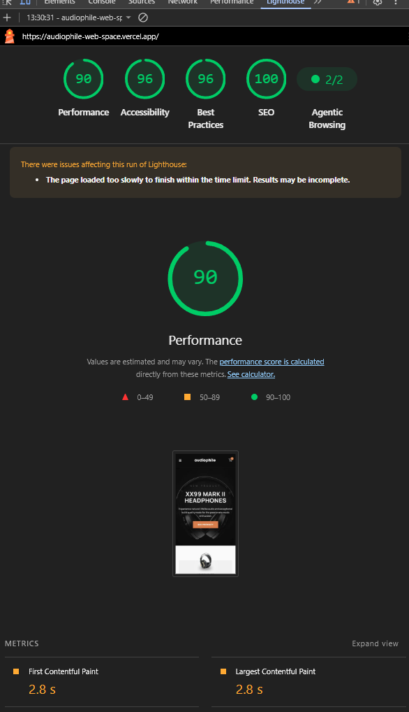
</p>

#### Desktop

<p>
    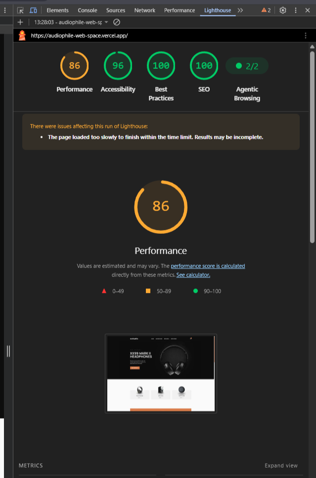
</p>

### Testing

<p>
    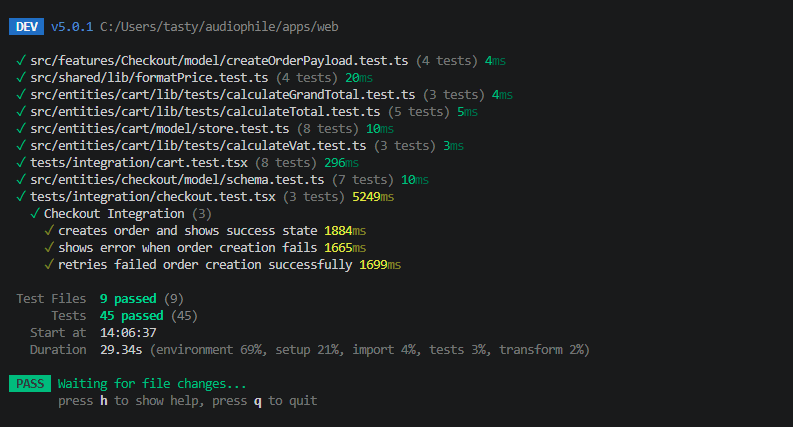
    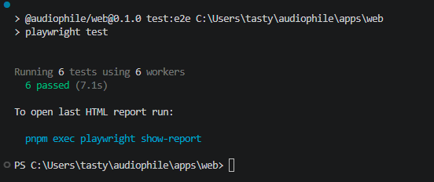
</p>

### Database

<p>
    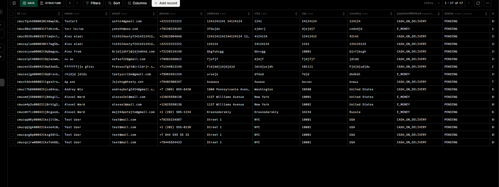
    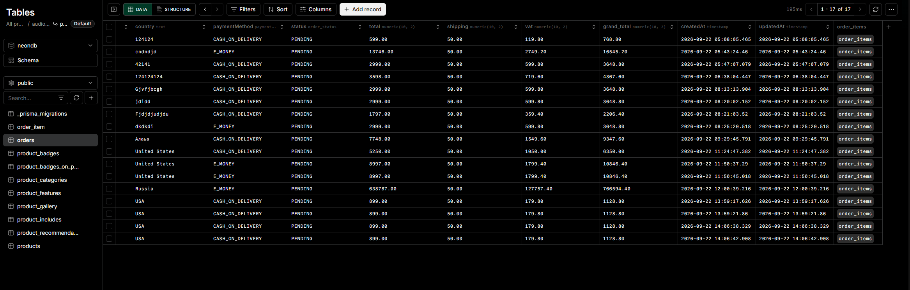
</p>

### Loging

<p>
    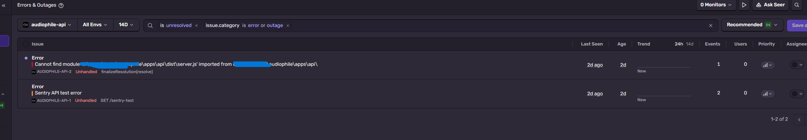
    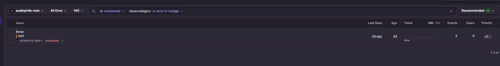
</p>

## Getting Started

### Prerequisites

Make sure you have the following installed:

- Node.js 24+
- pnpm 12+
- Docker

### Installation

```bash
git clone https://github.com/tastyfan14/audiophile.git
cd audiophile
pnpm install
```

### Environment

Create environment files for the frontend and backend and add the required environment variables.

See .env.example files in the corresponding applications for the required configuration.

### Database

Start the local PostgreSQL database using Docker:

```bash
docker compose up -d
pnpm --filter @audiophile/api prisma migrate deploy
```

### Development

Start frontend and backend in development mode:

```bash
pnpm dev
```

The application will be available at:

- **Frontend**: http://localhost:3000
- **Backend**: http://localhost:5000

### Testing

Run unit and integration tests:

```bash
cd apps/web
pnpm test
```

Run E2E tests:

```bash
cd apps/web
pnpm test:e2e
```

## Project Structure

```text
audiophile/
├── apps/
│   ├── web/
│   │   ├── src/
│   │   │   ├── app/
│   │   │   ├── entities/
│   │   │   ├── features/
│   │   │   ├── shared/
│   │   │   └── widgets/
│   │   └── tests/
│   │
│   └── api/
│       ├── docker-compose.yml       # Local PostgreSQL
│       ├── src/
│       │   ├── modules/
│       │   ├── shared/
│       │   └── config/
│       └── tests/
│
├── packages/
│   └── shared/
│       └── src/
│           ├── types/
│           └── config/
├── docs/                    # Instructions, screenshots, etc.
│
├── package.json             # Root workspace configuration
├── pnpm-workspace.yaml
├── turbo.json               # Turborepo configuration
└── README.md
```